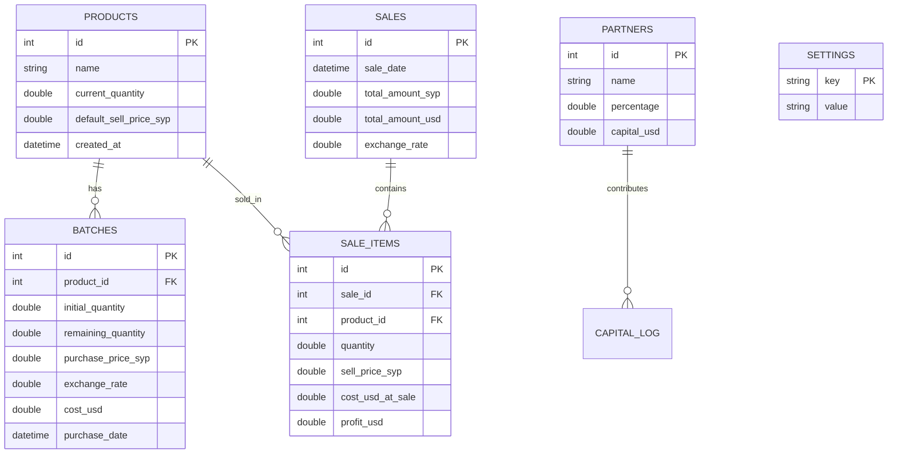

# 🗄️ هيكلية قاعدة البيانات (Database Schema)

هذا المستند يوضح الجداول والعلاقات اللازمة لتشغيل تطبيق "دكان" مع ضمان دقة الحسابات المالية ونظام FIFO.

---

## 📊 مخطط العلاقات (ER Diagram)

---

## 📝 تفاصيل الجداول

### 1. جدول التصنيفات (categories)
| الحقل | النوع | الوصف |
| :--- | :--- | :--- |
| id | INTEGER | مفتاح أساسي تلقائي |
| name | TEXT | اسم التصنيف (فريد) |

### 2. جدول المواد (products)
| الحقل | النوع | الوصف |
| :--- | :--- | :--- |
| id | INTEGER | مفتاح أساسي تلقائي |
| code | TEXT | رمز المادة (فريد) |
| name | TEXT | اسم المادة (فريد) |
| category_id | INTEGER | ربط بالتصنيف |
| current_quantity | REAL | الكمية الحالية المتوفرة |
| default_sell_price_syp | REAL | سعر البيع الافتراضي بالليرة |
| created_at | TEXT | تاريخ الإضافة |

### 3. جدول الدفعات (Batches)
**أهم جدول في النظام**، حيث يسمح بتطبيق نظام FIFO. كل عملية شراء تخزن كدفعة مستقلة بتكلفتها الخاصة.

| الحقل | النوع | الوصف |
| :--- | :--- | :--- |
| `id` | Integer | مفتاح أساسي. |
| `product_id` | FK | ربط مع جدول المواد. |
| `initial_quantity` | Double | الكمية الأصلية عند الشراء. |
| `remaining_quantity` | Double | الكمية المتبقية حالياً من هذه الدفعة. |
| `purchase_price_syp` | Double | سعر الشراء بالليرة السورية. |
| `exchange_rate` | Double | سعر الصرف وقت الشراء. |
| `cost_usd` | Double | التكلفة بالدولار (تحسب عند الإدخال: SYP / Rate). |

### 3. جدول المبيعات (Sales)
يوثق عملية البيع الكلية (الفاتورة).

| الحقل | النوع | الوصف |
| :--- | :--- | :--- |
| `id` | Integer | مفتاح أساسي. |
| `total_amount_syp` | Double | إجمالي الفاتورة بالليرة. |
| `total_amount_usd` | Double | إجمالي الفاتورة بالدولار. |
| `exchange_rate` | Double | سعر الصرف المستخدم وقت البيع. |

### 4. جدول تفاصيل المبيعات (SaleItems)
يوثق كل مادة داخل عملية البيع مع حساب الربح المحقق لها بالدولار.

| الحقل | النوع | الوصف |
| :--- | :--- | :--- |
| `cost_usd_at_sale` | Double | التكلفة الفعلية بالدولار (تؤخذ من الدفعات المستخدمة). |
| `profit_usd` | Double | صافي الربح بالدولار لهذه العملية. |

---

## ⚙️ ملاحظات تقنية
1. **نظام FIFO**: عند البيع، يقوم النظام بالبحث في جدول `Batches` عن أقدم دفعة لنفس المادة تحتوي على `remaining_quantity > 0` ويخصم منها أولاً.
2. **سعر الصرف**: يتم تخزين سعر الصرف الحالي في جدول `Settings` تحت مفتاح `current_exchange_rate`.
