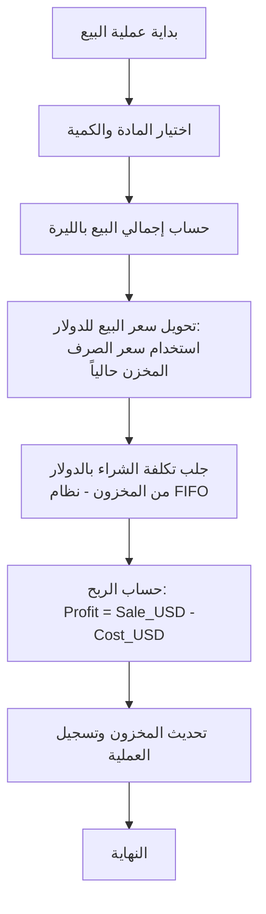
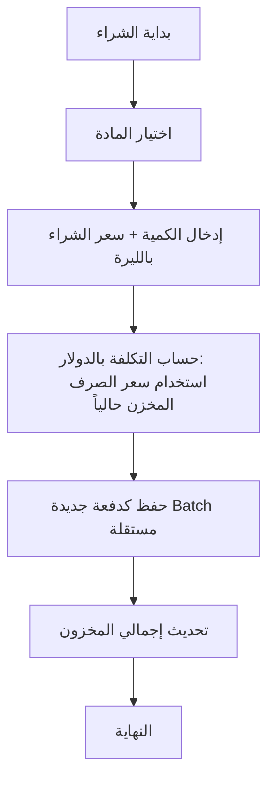

# 🔄 مخططات التدفق (Flowcharts)

توضح هذه المخططات تسلسل العمليات المنطقية داخل التطبيق.

## 1. سير عملية البيع وحساب الربح
يوضح هذا المخطط كيف يتم تحويل العملات وحساب الربح بالدولار عند كل عملية بيع.



---

## 2. سير عملية الشراء (إضافة مخزون)
يوضح كيفية إضافة كميات جديدة وتثبيت تكلفتها بالدولار.



---

## 3. منطق جرد المخزون والتقارير
يوضح كيفية استخراج حالة المحل المالية.

```mermaid
graph LR
    Rep[طلب تقرير] --> Period{تحديد الفترة}
    Period --> Collect[تجميع عمليات البيع والشراء]
    Collect --> Sum[حساب مجموع الأرباح بالدولار]
    Sum --> Partners[توزيع حصص الشركاء]
    Partners --> Export[تصدير التقرير PDF]

---

## 4. منطق مزامنة وتحديث سعر الصرف
يوضح هذا المخطط العملية المطلوبة عند فتح التطبيق أو الضغط على زر التحديث.

```mermaid
graph TD
    Start[فتح التطبيق / ضغط زر تحديث] --> Fetch[محاولة جلب السعر من الموقع]
    Fetch --> Success{هل تم الجلب بنجاح؟}
    
    Success -- نعم --> Show[عرض السعر المجلوب للمستخدم]
    Success -- لا --> Manual[طلب إدخال السعر يدوياً]
    
    Show --> Edit{موافقة أو تعديل؟}
    Edit -- موافقة --> Save[تخزين السعر الجديد في النظام]
    Edit -- تعديل --> Manual
    
    Manual --> Save
    Save --> End[عرض السعر بشكل دائم في الواجهة]
```
```
